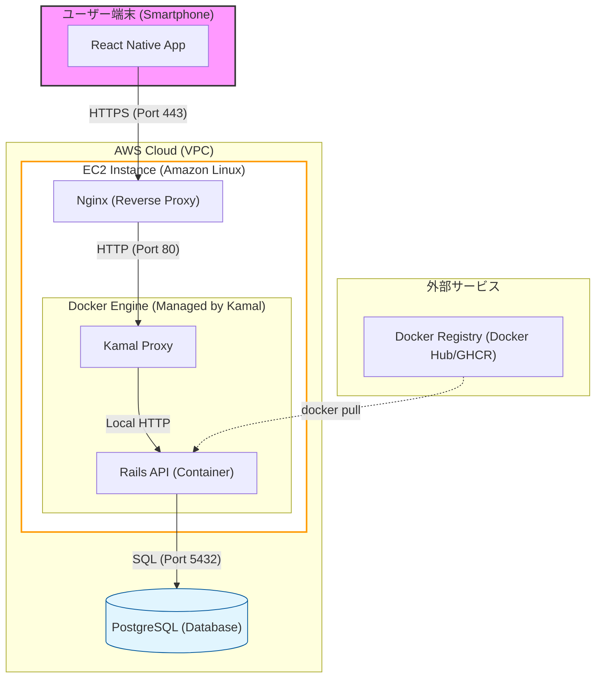

## はじめに
先日にサポーターズさんの主催する技育ハッカソン vol.19に参加した。最近インターンとかでお会いするレベルの高い同年代の学生をみていると、当たり前のようにアウトプットをしている。学びのためにもできるだけアウトプットをしたほうがいいと思うし、後々自分の記事を振り返った時面白そうなので、こういう機会は積極的にブログに残していきたいですね。

## 1日目
19:00からのキックオフに出た。参加者は40人くらいで、そのうち1/3が個人チーム、1/3が既存チーム、1/3が即席チームという感じだった。
自分は個人で最初から作りたいもののテーマがあったため、個人で出ることに。この日、このハッカソンとは別で申し込んでいたプログラムに落ちたメールが届いていたため、その鬱憤をぶつけようと思って気合いは十分。キックオフが終わってから、以下のような目標を立てた。

### 目標
- 機能要件
AWS(初)を使ってデプロイ：IaaS (Infrastructure as a Service) の基本である EC2 を中心に、ネットワーク（VPC）から自力で構築する
ReactNative(初)を使ってアプリ開発
認証機能を作る
レーティング機能を作る
オンライン対戦のBotを作る

- 非機能要件
最近学んだDDD設計、クリーンアーキテクチャを実践する。
テスタビリティを意識する。
スループットを意識する。

- その他
このハッカソンについてのブログを書く。
プレゼンで賞を取る。
ベータ版をリリースしてユーザーを獲得する。

### 計画
1週目前半　AWS環境構築
Day 1-2: EC2セットアップ, Kamal配置, Nginx設定
Day 3-5: Schema 設計
Day 6-7: オセロロジック & ユーザー認証 & ルーム管理 
Day 8-10: Action Cableによる双方向通信 & Docker 化
Day 11-13: AWSへの最終デプロイ & インフラ調整(kamal)
Day 14: 最終調整

### やったこと目次
23日 ハッカソン開始　アイディア出し なんとなくの計画だて
24日 なし
25日 なし
26日 DesignDocのプロット作成。EC2インスタンス作成。
27日 EC2ログイン。計画修正。
28日 なし
29日 なし
30日 1週目のマイルストーン モデリングをする。
31日
1日
2日
3日
4日
5日
6日 この辺までに作り終えたい

7日
8日 発表


### 次やること
EC2インスタンスで、余計なrbenvの削除、kamalのセットアップ
全体システム設計図の確定 (React Native app vpc ec2 nginx kamalによるdocker engine rails-api RDS Redis)
モデリング

### DesignDoc
```
1.  Abstruct
本プロジェクトの目的は、React Native と Ruby on Rails を用いて、リアルタイム対戦が可能なクロスプラットフォームのアプリを構築することです。アプリはオセロの派生ゲームである「オクトリバーシ」を題材とし、アプリはプレイヤー同士のランダム対戦、Botとの対戦、認証機能、レーティングでのランキング表示などの機能を含みます。ハッカソン期間内で、AWS上へのデプロイをし、ベータ版のリリースまでを完了させます。

2.1 Context

2.2 Goals (目標)

2.3 Non-Goals (今回は目標としないこと)

3. Proposed Design

3.1 High-level Architecture

- Frontend: React Native
- Backend: Ruby on Rails (API Mode) + Action Cable
- Infrastructure: AWS App Runner, Amazon RDS, Amazon ElastiCache (Redis)

3.2 System Flow (Sequence Diagram)
ユーザーがマッチングを開始。
Railsサーバーがルームを作成し、WebSocketチャネルを確立。
プレイヤーAが石を置く（POSTリクエストまたはWebSocket送信）。
サーバー側でバリデーションと盤面更新を行い、プレイヤーBにブロードキャスト。

4. Detailed Design (詳細設計)
4.1 Data Model (Schema)
4.2 API / WebSocket Protocol

5. Security & Privacy (セキュリティとプライバシー)

6. Alternatives Considered (代替案の検討)

7. Milestones (マイルストーン)

```

